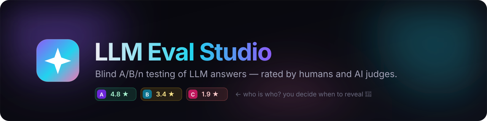
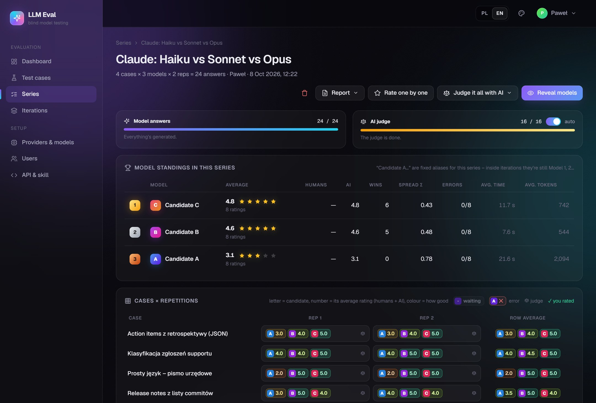
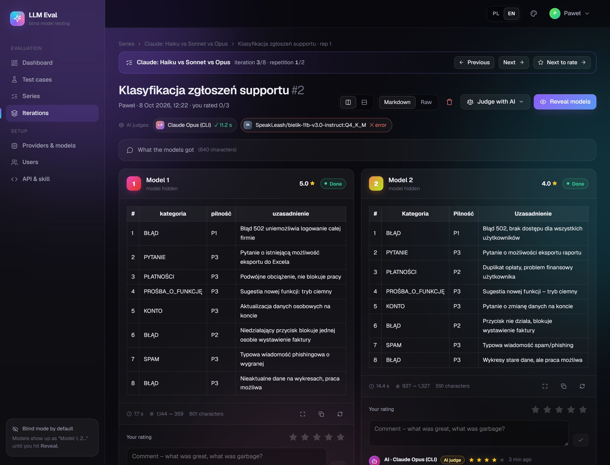
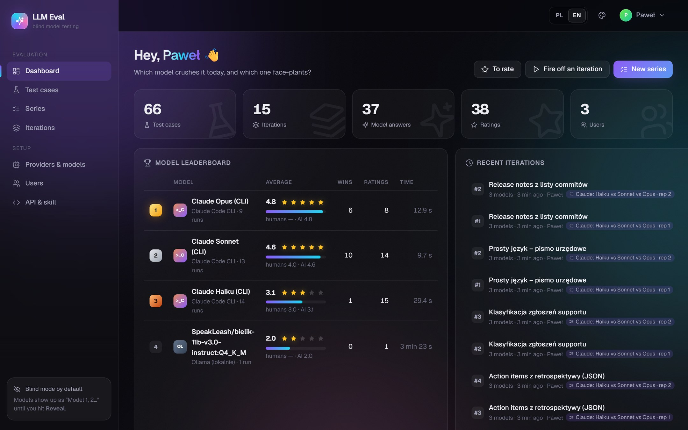
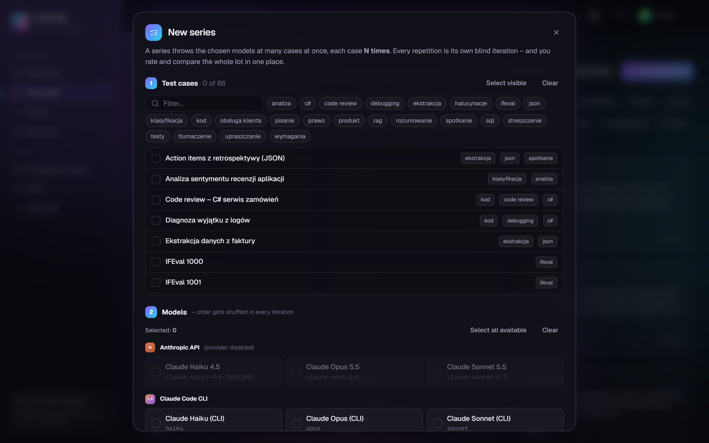
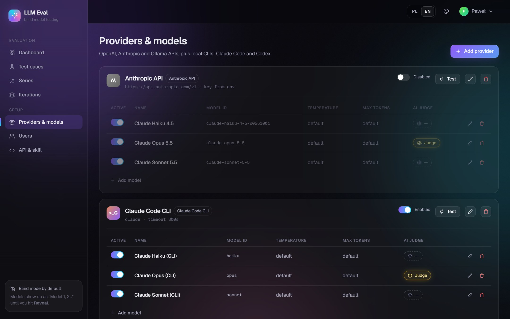
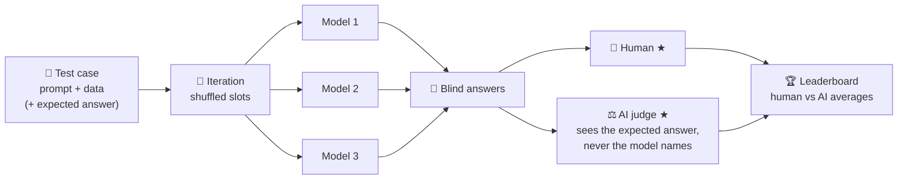
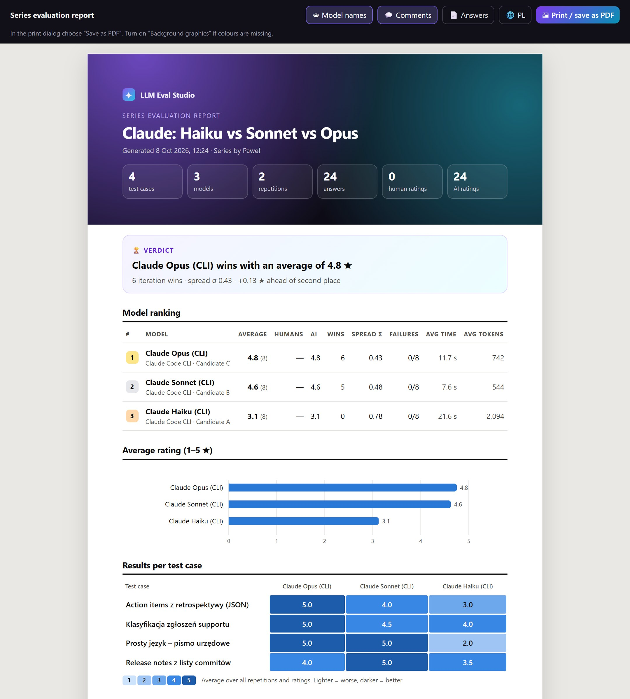

<p align="center">
  
</p>

<p align="center">
  
  
  
  
  <a href="LICENSE"></a>
</p>

<p align="center">
  <b>Which model actually gives better answers to <i>your</i> prompts?</b><br>
  Run the same task on several LLMs, hide which is which, and let people and AI judges rate them blind.
</p>

<p align="center"></p>

---

## ✨ What it does

| | |
|---|---|
| 🙈 **Blind by default** | Answers show up as *Model 1, 2, 3…* in random order. Click **Reveal** only after you've rated them. |
| ⚖️ **AI judge** | Mark any model as a judge. It rates every answer blind (1–5 ★ plus a reason) under its own bot account, next to human ratings. |
| ✦ **AI series summaries** | A judge summarizes every task across all repetitions, then the entire series. Export these concise descriptions instead of individual comments; saved summaries detect changed results or ratings. |
| 🎯 **Expected answers** | Add a reference answer to a test case. The models never see it; the judge compares the answers against it. |
| 🔁 **Series** | *N test cases × M models × K repetitions* in one click, with live progress, a per-model ranking, a spread score (σ) and a heat-map matrix. |
| 💸 **Response costs** | Toggle **Show cost** in an iteration to see provider-reported USD costs for answers and judges (OpenRouter and Claude Code CLI). Missing costs stay unknown; free responses show zero. |
| 🛑 **Stop runs** | Cancel one answer or judge, all generation or judging in an iteration, or a whole series. Queued work is skipped; active requests are cancelled and CLI process trees are stopped. Cancelled answers can be retried. Stopping a series also disables future auto-judging. |
| 🧩 **6 providers** | OpenAI API · OpenRouter API · Anthropic API · Ollama · **Claude Code CLI** · **Codex CLI** (use your subscription, no API key needed). |
| 📥 **Import** | JSON / JSONL, or rows straight from Hugging Face with `{{column}}` templates. Presets for IFEval, GSM8K and TruthfulQA. |
| 🗂️ **Categories & tags** | Group test cases under one category, assign a whole import to it, or move selected cases together. Filter by category and search for tags from a compact dropdown. |
| 🤖 **Agent-ready API** | Everything in the UI is also available over REST, with OpenAPI + Scalar docs and a ready-made [Claude skill](.claude/skills/llm-eval/SKILL.md). |
| 📄 **PDF reports** | One click turns a series into a print-ready report (verdict, ranking, chart, per-case heat map, judge comments). Save it as PDF straight from the browser. |
| 🌍 **PL / EN** | Full Polish and English UI, switchable in the top bar. Translations are plain JSON files, so adding a language is easy. |
| 🌙 **Dark UI** | 5 dark themes, live updates, glassmorphism. No admin panel from 2003. |

<table>
  <tr>
    <td width="50%"><p align="center"><sub>Blind answers, star ratings, AI judge comments</sub></p></td>
    <td width="50%"><p align="center"><sub>Dashboard and model leaderboard</sub></p></td>
  </tr>
  <tr>
    <td width="50%"><p align="center"><sub>Starting a series: cases × models × repetitions</sub></p></td>
    <td width="50%"><p align="center"><sub>Providers and models, one-click judge toggle</sub></p></td>
  </tr>
</table>

## 🚀 Quickstart

You need the **.NET 10 SDK** and **Docker** (Aspire starts PostgreSQL for you).

```bash
git clone https://github.com/doctorspider42/llm-eval-studio.git
cd llm-eval-studio
dotnet run --project src/LlmEval.AppHost
```

Then open **http://localhost:5106**. The Aspire dashboard link is printed in the console.

The database is migrated and seeded on first start with one user (`admin`), 6 providers and 16 sample test cases (the sample content is in Polish; the UI follows your browser language and can be switched to PL / EN).

**Models to test.** Any of these is enough:
- 🟣 `claude` CLI logged in (Claude Code) — seeded as Haiku / Sonnet / Opus
- 🦙 [Ollama](https://ollama.com) running locally
- 🔑 `OPENAI_API_KEY` / `OPENROUTER_API_KEY` / `ANTHROPIC_API_KEY` in the environment, or a key pasted on the *Providers* page
- ⌨️ `codex` CLI on `PATH`

**OpenRouter.** On *Providers*, add a provider with type **OpenRouter API** and paste your API key (or set `OPENROUTER_API_KEY`). Leave the base URL empty to use `https://openrouter.ai/api/v1`. Click **Test** to discover models, then click a model ID to add it. OpenRouter uses full model IDs such as `openai/gpt-5`; added models work in evaluations and as AI judges. Existing databases can add this provider from the UI without a migration. See the [OpenRouter API documentation](https://openrouter.ai/docs/api/api-reference/chat/create-a-chat-completion).

## 🧠 How it works



- Every iteration stores a **snapshot** of what was sent, so editing a test case never changes past results.
- CLI providers run **isolated**: Claude Code starts with no tools, no `CLAUDE.md` or settings, no MCP servers and a neutral system prompt. You're measuring the model, not your local setup.
- A **series** groups iterations. Within a series each model keeps a stable alias (*Kandydat A/B/C*), so you get aggregate stats without unblinding.

## 🤖 Let Claude do the judging

```bash
# start a series of 3 repetitions with auto-judging
curl -X POST localhost:5106/api/batches -H "Content-Type: application/json" -d '{
  "testCaseIds": ["…"], "modelIds": ["…", "…"], "repetitions": 3, "autoJudge": true }'

# wait for answers + judge, then read the ranking
curl "localhost:5106/api/batches/{id}/wait?timeoutSeconds=900"
```

Or open Claude Code in this repo and say *"rate all unrated iterations in LLM Eval"*. The [skill](.claude/skills/llm-eval/SKILL.md) covers the rest. Full API docs are at **`/scalar`**.

## 📄 Reports

On a series page, **Export report** opens a standalone A4 document:
- a verdict (winner, margin, consistency)
- the model ranking and a bar chart of human vs AI averages
- a heat map of test cases × models
- every test case with its prompt, expected answer, scores and judge comments

<p align="center"></p>

📎 **[See a sample PDF report](docs/sample-report.pdf)**, generated from a real run of Haiku vs Sonnet vs Opus.

Model names, comments and full answers can each be turned on or off. The print dialog opens on its own, so *Save as PDF* is one click. The same report is available from the API: `GET /api/batches/{id}/report?lang=en&reveal=true`.

## 🌍 Translations

The UI ships in 🇵🇱 Polish and 🇬🇧 English. Strings live in `src/LlmEval.Web/Resources/i18n/{pl,en}/*.json`, one flat `"key": "text"` map per area. To add a language, copy the `en` folder, translate it and add the language code to `I18n.Languages`. Missing keys are logged at startup in Development.

## 📥 Bring your own data

**Import** on the test case list accepts:
- JSON or JSONL, with fields `title`, `prompt`, `data`, `expectedAnswer`, `systemPrompt`, `tags` (other column names can be mapped)
- Any Hugging Face dataset via the public datasets-server, e.g. `openai/gsm8k` with mapping `prompt = {{question}}`, `expected = {{answer}}`

Imported cases come back already selected, so you can start a series on them right away.

## 🗂️ Project layout

```
src/LlmEval.AppHost          Aspire: Postgres + pgweb + web app
src/LlmEval.ServiceDefaults  OpenTelemetry, health checks
src/LlmEval.Web
  Api/         minimal API (/api/…)
  Data/        EF Core entities, migrations, seed
  Llm/         clients: OpenAI, OpenRouter, Anthropic, Ollama, Claude CLI, Codex CLI
  Services/    EvalService (shared by UI and API), runners, AI judge, import
  Components/  Blazor UI
```

## 📄 License

[MIT](LICENSE) © Paweł Pająk
